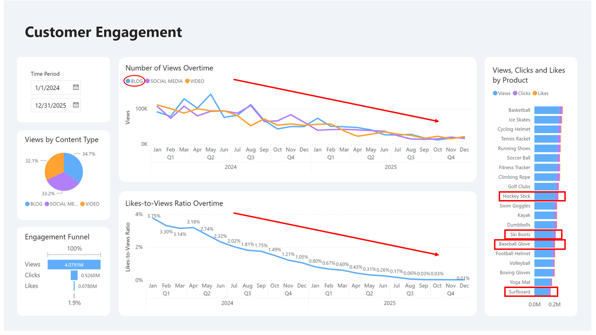
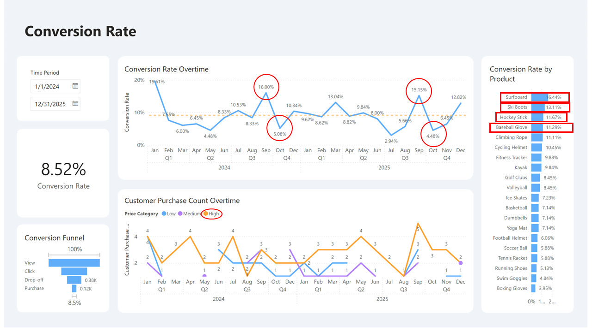
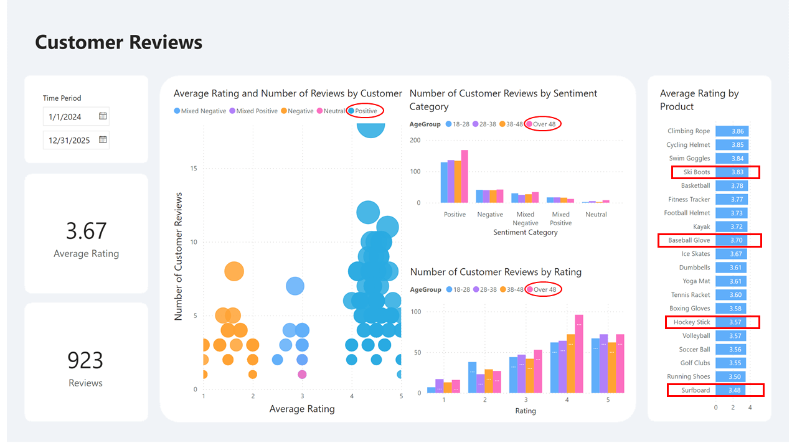

# ShopEasy Marketing Analysis

## Introduction
This is a Power BI project on marketing analysis of an imaginary online retail business call **Shop Easy**.  
**_Disclaimer_**: _All datasets and reports do not represent any company, institution or country, but just a dummy dataset to demonstrate capabilities of Power BI._

## Skills / concepts demonstrated:
- Power BI
- SQL
- Python

## Problem Statement
1. Which content types should be improved to raise customer engagement?
2. What actions should be take to raise conversion rate?

## Modelling

There are 3 fact tables and 3 dimension tables. The dimension tables are all joined to fact tables with a one-to-many relationship.

## Visualization:
The report comprises 3 pages:
1. Customer Engagement
2. Conversion Rate
3. Customer Reviews
You can interact with the report [here](https://app.powerbi.com/view?r=eyJrIjoiZmQ2NDc4MjMtMzkyOC00OWIzLTlkYjQtZDI2OTJkOTNkZTkwIiwidCI6IjQ0ZGMyOGI5LTI1NzAtNDcxMi1iNzRmLWI4ZGM3MTBkZjRmNCIsImMiOjEwfQ%3D%3D)

## Analysis:

### Customer Engagement

### Conversion Rate

### Customer Reviews

