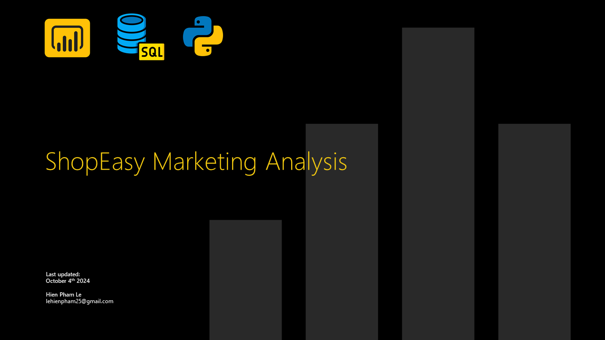

# ShopEasy Marketing Analysis

## Project Overview
This is a Power BI project on marketing analysis of an imaginary online retail business call **Shop Easy**.  
**Shop Easy** is facing reduced customer engagement and conversion rates since January 2024. They need help to conduct a detailed analysis and identify areas for improvement in their marketing strategies.

**_Disclaimer_**: _All datasets and reports do not represent any company, institution or country, but just a dummy dataset to demonstrate capabilities of Power BI._

## Tech Stack
- Power BI
- SQL
- Python

## Business Key Questions
1. Which content types should be improved to raise customer engagement?
2. What actions should be take to raise conversion rate?

## Data Sources
I collect data from some tables that stored in SQL Server:
- **Customer Engagement:** customer's views, clicks and likes on content type, product and campaign.
- **Customer Journey:** customer's actions like view, click, drop-off, purchase on product.
- **Customer Reviews:** customer's reviews and rating on product.
- **Products:** product information like category and price.
- **Customers:** customer information like gender, age, city.
Data is assumed for a 3 years period from 2023 to 2025.

## Data Model

There are 3 fact tables and 3 dimension tables. The dimension tables are all joined to fact tables with a one-to-many relationship.

## Visualizations
The report comprises 3 pages:
1. Customer Engagement
2. Conversion Rate
3. Customer Reviews

You can interact with the report [here](https://app.powerbi.com/view?r=eyJrIjoiZmQ2NDc4MjMtMzkyOC00OWIzLTlkYjQtZDI2OTJkOTNkZTkwIiwidCI6IjQ0ZGMyOGI5LTI1NzAtNDcxMi1iNzRmLWI4ZGM3MTBkZjRmNCIsImMiOjEwfQ%3D%3D)

## Key Insights

- A consistent decline in both the number of views and the likes-to-views ratio was observed from January 2024 to December 2025.
- The distribution of views across the three content types—Blog (34.7%), Social Media (33.2%), and Video (32.1%)—was relatively balanced. However, the Blog category exhibited a sharper decline in views compared to the other two content types.
- The likes-to-views conversion funnel experienced a significant drop, starting at 3.75% in January 2024 and steadily decreasing to only 0.01% by December 2025, with a steep downward trend throughout the period.

### Conversion Rate

- The average conversion rate was 8.52%, with significant fluctuations month-to-month throughout the period. A consistent pattern emerged in both years, where conversion rates peaked in September (16% in 2024, 15.15% in 2025) and hit their lowest in November (5.08% in 2024, 4.48% in 2025).
- When categorizing products by price: high-priced (> $200), mid-priced ($50–$200), and low-priced (< $50), the high-priced group consistently saw the highest number of purchases.
- Interestingly, products with the highest conversion rates—Surfboard (16.44%), Ski Boots (13.11%), Hockey Stick (11.67%), and Baseball Glove (11.29%)—belonged to the category with lower view counts.

### Customer Reviews

- Over the course of two years, there were 923 reviews with an average rating of 3.67 on a scale of 1 to 5.
- Sentiment analysis of the reviews reveals that the majority of positive reviews were associated with higher ratings, while negative reviews, linked to lower ratings, slightly outnumbered neutral reviews, which generally had mid-range ratings.
- Among the positive reviews, customers aged 48 and above contributed the most, particularly at the 4-star rating level.
- The top products with the highest conversion rates did not appear among those with the highest ratings. Notably, the Surfboard, which had the highest conversion rate, received the lowest rating among all products.

## Recomendations
### Marketing Performance Improvement
Marketing efforts face significant challenges in both the number of views and the likes-to-views ratio. I recommend the following actions:
- Increase advertising and enhance SEO strategies to reach a broader audience of potential customers.
- Research trending content to boost engagement and improve the likes-to-views ratio.
### Conversion Rate Enhancement
To improve conversion rates, the following strategies are proposed:
- High-priced products (>$200) show strong potential and should become a key focus for marketing investment.
- The customer segment aged 48 and above shows the highest number of positive reviews, suggesting the need for targeted campaigns to further engage this group. Additionally, reviews from younger age groups should be analyzed to create more appealing content for them.
- Products with high conversion rates are not currently attracting high views or ratings. Focus on increasing engagement with these products and gathering customer feedback to improve their ratings.

## Conclusion
